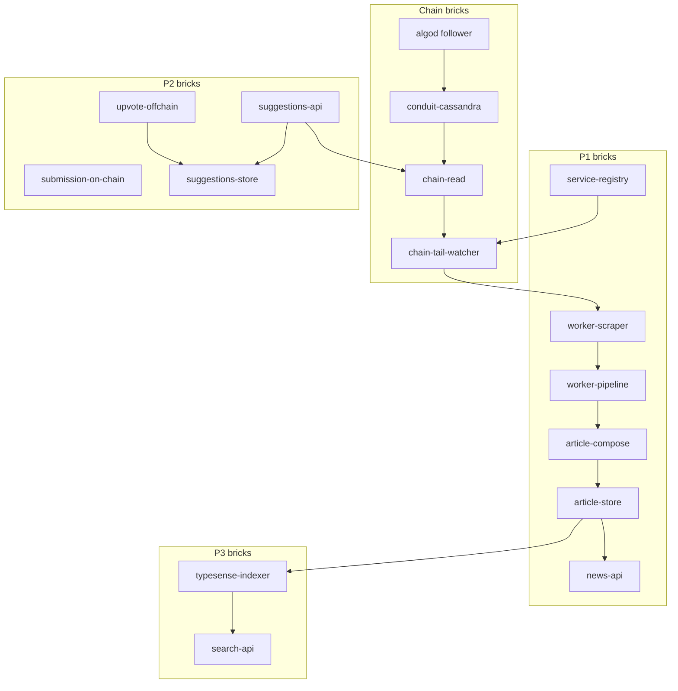

# Products and bricks

**Products** = what we ship. **Bricks** = modules we implement.

Each brick doc under `docs/modules/` includes:

1. **Features (should do)** — required behaviour  
2. **Good to have** — valuable, not blocking v1  
3. **Future improvements** — later phase or new bricks  
4. **Standards & RFCs** — normative specs (ARC, CAIP, IETF RFC, W3C) before coding  

**Before implementing a brick:** [brick-implementation-guide.md](brick-implementation-guide.md) → [standards-and-rfcs.md](standards-and-rfcs.md).

Index: [modules/README.md](../modules/README.md).

Data: **Cassandra** = SoT for app + kept chain tables; **Typesense** = Search indexing only; **Redis** = sessions, Celery broker, tail cursors.

Release: [release-cadence.md](release-cadence.md) — 2w dev → freeze → 2w TestNet → release.

Brick index: [modules/README.md](../modules/README.md).

---

## Product lineup

| ID | Product | Ship with | Bricks (summary) |
|----|---------|-----------|------------------|
| **0** | Wallet auth | Foundation | `wallet-auth`, `wallet-auth-flutter`, `frontend-auth`, `session-store`, `web-platform` |
| **1** | Newspaper | **With P2** | `service-registry`, `chain-tail-watcher`, `worker-scraper`, `worker-pipeline`, `article-compose`, `article-store`, `news-api`, `frontend-newspaper` + chain bricks |
| **2** | Suggestions | **Paused** (disabled via `SUGGESTIONS_ENABLED`, default off) | `submission-on-chain`, `suggestions-api`, `suggestions-store`, `upvote-offchain`, `frontend-suggestions` |
| **3** | Search | Initial | `search-api`, `typesense-indexer`, `frontend-search`; `algorand-page-classifier` **partial** (heuristic scorer) |

---

## Shared platform bricks

| Brick | Status |
|-------|--------|
| `deployment` | done |
| `wallet-auth` | done |
| `wallet-auth-flutter` | done |
| `frontend-auth` | done |
| `frontend-shell` | done |
| `web-platform` | done |
| `session-store` | done |
| `celery-redis-queues` | done |
| `cassandra-schema-migrations` | done |
| `cassandra-repository` | partial |
| `health-observability` | done |
| `quality-ci` | done |

---

## Chain bricks (shared)

| Brick | Status |
|-------|--------|
| `conduit-cassandra` | done |
| `chain-read` | done |

---

## Product 1 — Newspaper bricks

| Brick | Status | Doc |
|-------|--------|-----|
| `service-registry` | done | [service-registry.md](../modules/service-registry.md) |
| `chain-tail-watcher` | done | [chain-tail-watcher.md](../modules/chain-tail-watcher.md) |
| `worker-scraper` | partial | [worker-scraper.md](../modules/worker-scraper.md) |
| `worker-pipeline` | partial | [worker-pipeline.md](../modules/worker-pipeline.md) |
| `article-compose` | partial | [article-compose.md](../modules/article-compose.md) |
| `article-store` | done | [article-store.md](../modules/article-store.md) |
| `news-api` | done | [news-api.md](../modules/news-api.md) |
| `frontend-newspaper` | partial | [frontend-newspaper.md](../modules/frontend-newspaper.md) |
| `weekly-price-analysis` | partial | [weekly-price-analysis.md](../modules/weekly-price-analysis.md) |
| `price-metrics-mistral` | done | [price-metrics-mistral.md](../modules/price-metrics-mistral.md) |
| `ai-mistral-connector` | partial | [ai-mistral-connector.md](../modules/ai-mistral-connector.md) |
| `redis-feed-cache` | not_started | — |

Overview: [newspaper.md](../modules/newspaper.md).

---

## Product 2 — Suggestions bricks

| Brick | Status | Doc |
|-------|--------|-----|
| `submission-on-chain` | done | [submission-on-chain.md](../modules/submission-on-chain.md) |
| `suggestions-api` | done | [suggestions-api.md](../modules/suggestions-api.md) |
| `suggestions-store` | done | [suggestions-store.md](../modules/suggestions-store.md) |
| `upvote-offchain` | done | [upvote-offchain.md](../modules/upvote-offchain.md) |
| `frontend-suggestions` | done | [frontend-suggestions.md](../modules/frontend-suggestions.md) |

Overview: [suggestions.md](../modules/suggestions.md).

---

## Product 3 — Search bricks

| Brick | Status | Doc |
|-------|--------|-----|
| `typesense-indexer` | partial | [typesense-indexer.md](../modules/typesense-indexer.md) |
| `search-api` | partial | [search-api.md](../modules/search-api.md) |
| `frontend-search` | partial | [frontend-search.md](../modules/frontend-search.md) |
| `algorand-page-classifier` | partial | [algorand-page-classifier.md](../modules/algorand-page-classifier.md) |
| `page-crawl-index` | not_started | — |

---

## Deploy slice (P1 + P2)

One Flutter web app:

- `frontend-shell` — News | Suggestions | Search
- `frontend-newspaper`, `frontend-suggestions`, `frontend-search`
- `frontend-auth` + `web-platform`

---

## Data flow

---

## Config knobs

| Key | Brick |
|-----|--------|
| `SUGGESTIONS_ENABLED` (backend setting + frontend `--dart-define`, default `false`) | `suggestions-api`, `frontend-suggestions` |
| `PLATFORM_TREASURY_ADDRESS` | `submission-on-chain` |
| `SUGGESTION_MIN_MICROALGOS` | `submission-on-chain` |
| `AUTH_DOMAIN`, `CORS_ALLOWED_ORIGINS` | `web-platform` |
| `NEWS_STORE`, `SUGGESTION_STORE`, `UPVOTE_STORE` | respective stores |
| `TYPESENSE_*` | `typesense-indexer`, `search-api` |
