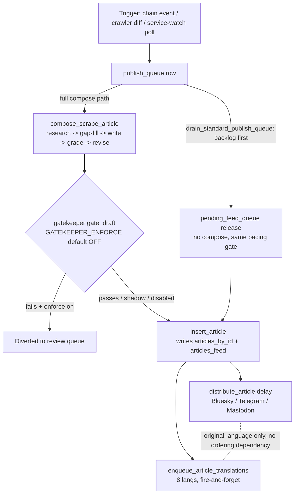

# Publish pipeline — compose → gate → publish → translate → distribute

Cross-cutting workflow doc spanning `newspaper`, `gatekeeper`, `article-translations`
and `distribution` bricks. Traced against code 2026-07-13 — verify line numbers
before relying on them if this doc gets old.

> **2026-08-25 selection-layer cutover**: the "land a row on `publish_queue`,
> a drain picks it up" description below (§ Entry points / Two release
> shapes) describes the RETIRED selection mechanism. The live path now is:
> every trigger below still writes to `publish_queue` (kept live-fed,
> rollback safety only) but ALSO writes an `artifacts` row
> (`newspaper/artifact_store.py`); `artifact_priority.py` scores pending
> artifacts daily; `to_compose_selection.select_to_compose_for_day` picks
> each day's compose slate (one admin-pinned "human" slot + N-1 top-priority
> "platform" slots); `queue_drain_tasks.drain_to_compose` composes from that
> slate on the old drain's cadence, calling the exact same
> `publish_from_queued_row` this doc describes below (via an artifact->row
> adapter) — so everything from "Ordered steps (full compose path)" onward
> is still accurate for what a compose actually DOES, just no longer for how
> a candidate gets SELECTED. The BREAKING tier/lane (`drain_breaking_publish_queue`,
> `PublishTier.BREAKING`) was removed entirely, not carried into the new
> system. See `queue_drain_tasks.py`'s module docstring for the full picture.

## Entry points into the pipeline

| Trigger | Where |
|---|---|
| Chain event (service txn seen) | `chain_tail/tasks/watch_blocks.py:66` → `publish_from_chain_event` (`publish_tasks.py:1065`) |
| Crawler/diff discovery | `newspaper/llm_diff_check.py:36` |
| Service-watch pollers (YouTube, forum, Bluesky, mail) | `scraper/tasks/{youtube,forum,bluesky}_poll_tasks.py`, `newspaper/tasks/mail_poll_tasks.py` — enqueue straight onto the publish queue, skipping the scrape step |
| Manual recompose (admin) | `recompose_review` (`publish_tasks.py:1107`) |
| Auto-refresh of a published article | `recompose_published` (`publish_tasks.py:1427`) |

All non-recompose triggers land a row on `publish_queue`; a drain
(`queue_drain_tasks.py`) or `publish_from_queued_row` (`publish_tasks.py:408`)
picks it up and does the actual work.

## Two release shapes, one task

**A. Full compose path** (`drain_breaking_publish_queue`, `drain_standard_publish_queue`,
direct chain-event publish) — runs compose, gatekeeper, and quality-floor checks.

**B. Admin-approved backlog release** — a human already approved a draft via
the review UI, but the daily feed cap was full at approval time so it sat in
`pending_feed_queue`. Releasing it writes straight to the feed with **no
compose and no gatekeeper call**, but still runs translation + distribution
(steps 4–5 below), identically to path A. This used to be its own Celery
task/beat entry (`drain_approved_feed_queue`) — folded into
`drain_standard_publish_queue` (2026-07-14) as an early step, since both
already shared one pacing gate (`is_standard_publish_due`) and one daily
budget: a backlog item is tried first (cheap, no compose cost) before
`drain_standard_publish_queue` considers composing anything new.
`drain_approved_feed_queue` itself is still registered as a Celery task
(manual/debug triggers only, not on the beat schedule).

## Ordered steps (full compose path)

1. **Compose** — `compose_scrape_article` (`publish_tasks.py:543`) → Mistral path
   `compose_scrape_article` (`llm_compose.py:2214`); the
   research → gap-fill → write → grade → revise loop is `_review_and_revise`
   (`llm_compose.py:617`).
2. **Gate** — `gate_draft` (`gatekeeper/live.py`) is called from up to 5 sites
   in `publish_tasks.py` (lines ~196, 277, 728, 1295, 1586) depending on which
   path the draft takes. **`GATEKEEPER_ENFORCE` defaults off** — the
   deterministic gate runs and logs but does not block; the ModernBERT
   quality/relevance heads have no training or serving wiring at all (see
   [gatekeeper.md](../modules/gatekeeper.md)). The thing that actually
   diverts low-quality drafts today is `_quality_floor_fails`
   (`publish_tasks.py:224`, `WRITER_QUALITY_GATE_ENABLED`, default on) — the
   writer's own heuristic grade, not the gatekeeper.
3. **Persist** — `insert_article` (`publish_tasks.py:804` → `article_store.py:226`)
   writes `ArticleStmts.INSERT` then, since `publish_to_feed=True`,
   `FeedStmts.INSERT`. Presence in `articles_feed` **is** the published state
   — there's no separate status column.
4. **Distribute** — `distribute_article.delay(article_id=...)` queued at
   `publish_tasks.py:842`. Builds the social post from `article.title` /
   `article.summary` only — **never reads `article.translations`**, so posts
   are always in the original (English) language regardless of what's
   translated yet.
5. **Translate** — `enqueue_article_translations` at `publish_tasks.py:904`
   (called *after* the distribution enqueue, but both are async — no ordering
   guarantee or dependency between them, and none is needed since
   distribution doesn't consume translations). Fans out one fire-and-forget
   Celery task per language in `ARTICLE_TRANSLATION_LANGS` (`fa, ps, ar, ru,
   zh, hi, es, fr` — all 8 non-English UI locales) via `translate_article`
   (`publish_tasks.py:1357` → `llm_compose.py:1936`,
   `MISTRAL_MODEL_TRANSLATE=mistral-small-latest`).

## Recompose behavior (published-article auto-refresh)

`apply_recomposed_article` (`publish_tasks.py:1649`) swaps the live content
and **re-enqueues translations** (clearing the old ones first,
`publish_tasks.py:1711`) but **deliberately never calls `distribute_article`**
(see docstring at `distribution_tasks.py:4-6`) — editorial edits shouldn't
trigger a second social post.

## Depends on

- [gatekeeper.md](../modules/gatekeeper.md), [distribution.md](../modules/distribution.md),
  [article-translations.md](../modules/article-translations.md), [article-compose.md](../modules/article-compose.md)
