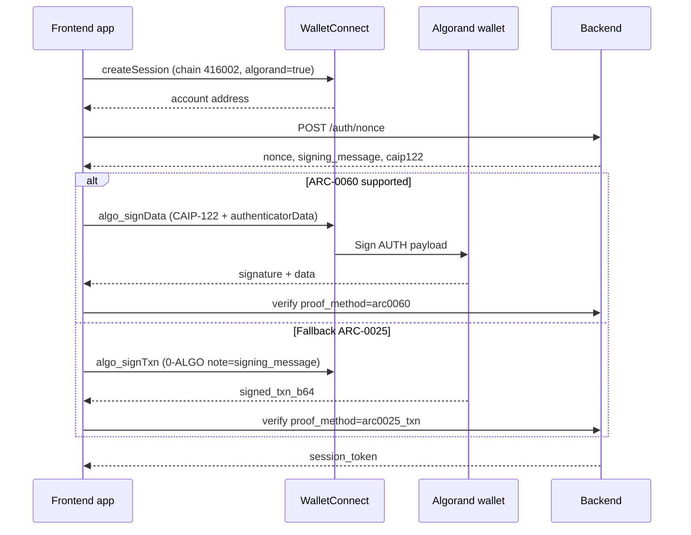

# Wallet Auth Protocol — ARC-0025, ARC-0060, SIWA / CAIP-122

This document describes the **Wallet Auth brick** implementation across backend (`backend/app/modules/auth/`) and the frontend client (`frontend/src/lib/auth/`, Vite + Svelte). The `opensource/wallet_auth_flutter/` Flutter package this doc used to describe client-side now belongs to the separate x402/KYC app (`frontend_kyc/`), not the main newspaper frontend.

**Coverage:** full **SIWA / CAIP-122** message generation, **ARC-0060 AUTH** verification (reference-aligned with `assets/arc-0060/arc60wallet.api.ts`), and **ARC-0025** WalletConnect session + `algo_signTxn` fallback.

**RFC index:** [standards-and-rfcs.md](standards-and-rfcs.md) (CAIP-122, ARC-0025/0060, RFC 8785 JCS, RFC 8032 Ed25519).

---

## Standards map

| Standard | Role in login | Implementation |
|----------|---------------|----------------|
| **CAIP-122 / SIWA** | Canonical auth payload + EIP-4361 display string | `caip122.py` / `siwa_message.py` (backend), consumed inline via the `LoginChallenge` returned from `POST /auth/nonce` (`frontend/src/lib/auth/session.ts`, `walletProviders.ts`) |
| **ARC-0060** | Preferred proof: `signData` AUTH scope | `arc0060_verify.py`, `arc0060.dart`, WC methods `algo_signData` / `signData` |
| **ARC-0025** | WalletConnect v1 + `algo_signTxn` fallback | `walletconnect_algorand_connector.dart`, `algorand_txn_verify.py` |
| **ARC-1** | `WalletTransaction` shape (`txn`, `signers`, `message`) | Used in `algo_signTxn` requests |

---

## Proof methods

| `proof_method` | Wallet action | Backend verifier |
|----------------|---------------|------------------|
| `arc0060` (default) | `algo_signData` / `signData` with CAIP-122 JSON in `data` | `verify_arc0060_auth` |
| `arc0025_txn` | 0-ALGO self-payment, `note` = SIWA `prepareMessage()` string | `verify_auth_transaction` |
| `legacy_message` | Raw Ed25519 over UTF-8 message (dev / tests) | `verify_wallet_signature` |

**Client strategy:** try ARC-0060 first; if the wallet does not support it, fall back to ARC-0025 txn auth.

---

## ARC-0060 AUTH signing input

Per the ARC reference implementation:

1. Parse `data` (base64) as JSON (CAIP-122 object).
2. Canonify JSON (sorted keys, minimal separators — matches ARC test vectors).
3. `clientDataHash = SHA256(canonifiedJson)`
4. `authenticatorDataHash = SHA256(authenticatorData)` (min. 32-byte `rpIdHash = SHA256(domain)`)
5. Sign `clientDataHash || authenticatorDataHash` with Ed25519.

---

## SIWA / CAIP-122 fields

Nonce responses include:

- `signing_message` — EIP-4361 / `@avmkit/siwa`-compatible display text (`prepareMessage()`).
- `caip122` — JSON object signed under ARC-0060 (`domain`, `account_address`, `uri`, `chain_id`, `nonce`, `issued-at`, `expiration-time`, `type`, …).

`chain_id` uses **CAIP-2** (e.g. `algorand:SGO1GKSzyE7IEPItTxCByw9x8FmnrCDe` for TestNet).  
`signing_message` uses **WalletConnect chain id** in the `Chain ID:` line (e.g. `416002` per ARC-0025).

---

## ARC-0025 WalletConnect

- Session URI includes `algorand=true` (`withAlgorandWalletConnectParam`).
- Default chain id: **416002** (TestNet); also supports 416001 / 416003 / legacy 4160.
- `algo_signTxn` sends ARC-1 `WalletTransaction`: `{ txn, signers: [address], message }`.

---

## API

### `POST /api/v1/auth/nonce`

```json
{
  "wallet_address": "..."
}
```

Response adds `caip122` alongside `signing_message` and `nonce`.

### `POST /api/v1/auth/verify-wallet-signature`

ARC-0060:

```json
{
  "wallet_address": "...",
  "nonce": "...",
  "proof_method": "arc0060",
  "arc0060": {
    "data_b64": "...",
    "signature_b64": "...",
    "authenticator_data_b64": "...",
    "domain": "..."
  }
}
```

ARC-0025 fallback:

```json
{
  "proof_method": "arc0025_txn",
  "signed_txn_b64": "..."
}
```

---

## Login flow (sequence)



---

## Configuration

| Setting | Default | Purpose |
|---------|---------|---------|
| `AUTH_DOMAIN` | `algorand-platform.local` | SIWA domain + ARC-0060 `domain` |
| `AUTH_URI` | `https://…/sign-in` | CAIP-122 `uri` |
| `AUTH_CAIP2_CHAIN_ID` | `algorand:SGO1…` | CAIP-122 `chain_id` |
| `AUTH_WALLET_CONNECT_CHAIN_ID` | `416002` | ARC-0025 session + SIWA `Chain ID:` line |

---

## Tests

- `backend/tests/test_arc0060_verify.py` — ARC-0060 reference vector (CAIP-122 case).
- `backend/tests/test_siwa_message.py` — SIWA message shape.

Run (with project venv + dependencies):

```bash
cd backend && PYTHONPATH=. pytest tests/
```

---

## Wallet support notes

- **ARC-0060** over WalletConnect is newer; Pera and others may expose `algo_signData` or `signData`. Unsupported wallets automatically use ARC-0025 txn login.
- Txn `note` is limited to **1000 bytes**; SIWA messages are kept within that budget for the fallback path.
