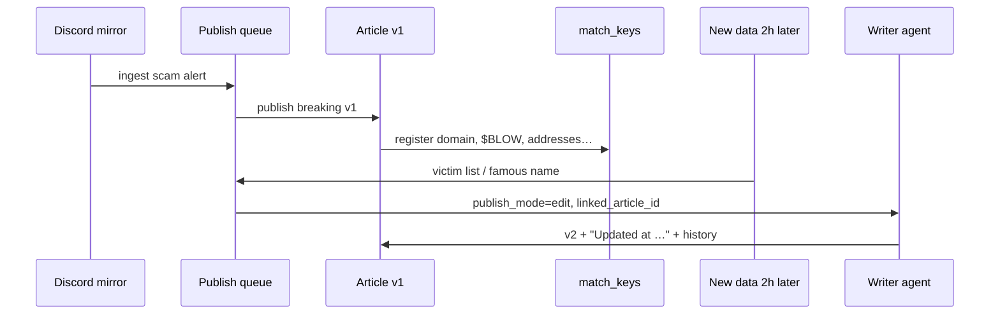

# Editorial platform vision (Guillaume, June 2026)

Product notes from the **algoblow** incident: Discord was the best real-time source; community followed with victim addresses and a high-profile name. The platform should support **fast publish → enrich → edit in place**, with a **tool-using writer agent** and an **admin UI** — not only one-shot Mistral compose.

## Roles

| Role | Who | Does |
|------|-----|------|
| **Ingest** | Crawlers, extension, push, Discord mirror | Raw signals → queue |
| **Writer agent** | Server AI (thinking model + tools) | Research, draft, **edit** articles |
| **Editor / admin** | Wallet allowlist (you) | Briefs, manual create/edit, review versions |
| **Reader** | Public | Feed + “Updated …” on edited stories |

## 1. Admin UI (wallet-gated)

Today: [admin_page.dart](../../frontend_flutter/lib/modules/admin/ui/admin_page.dart) → sources only.

**Target admin panel** (same wallet gate as `adminWalletAddresses`):

| Area | Features |
|------|----------|
| **Dashboard** | Open breaking stories, edit windows closing, pending briefs |
| **Articles** | List → markdown editor → create / edit / preview |
| **Suggestion box** | “Briefs” for the writer: title, markdown notes, keywords, URLs — **not** written by you as final copy; input for the agent |
| **Ingest monitor** | Recent push/extension/Discord mirrors; link to “attach to article” |

APIs to add: `GET/PATCH /api/v1/admin/articles`, `POST /api/v1/admin/briefs`, wallet auth middleware.

## 2. Writer agent (not a single prompt)

Evolve from `llm_compose.py` one-shot to an **agent loop**:

- **Model:** thinking / reasoning tier (e.g. Mistral `mistral-medium-latest` or dedicated `MISTRAL_MODEL_AGENT`).
- **Tools (function calling):**
  - `search_platform` — Typesense + Cassandra (articles, snapshots, match keys)
  - `fetch_url_safe` — allowlisted HTTP fetch (no wallet connect pages)
  - `get_article` / `list_article_versions`
  - `draft_article` / `edit_article` — returns markdown + changelog block
  - `get_editorial_brief` — pull suggestion-box row
  - `get_enrichment_bundle` — writer enrichment + scam context

Stub: `workers/app/modules/newspaper/writer_agent/`

## 3. Publish → edit flow (scam example)



**Rules:**

- **First publish:** immediate breaking article (current pipeline).
- **Follow-up within 24h** (`ARTICLE_EDIT_WINDOW_HOURS`): same story → **edit**, not a second feed card (or linked “update” section — product choice).
- **After window:** new article or “Part 2” with `story_thread_id`.

## 4. How we decide “this data matches an article”

Lookup table **`article_match_keys`** (not a relational DB, but same idea):

| `key_type` | `key_value` example |
|------------|---------------------|
| `service_id` | `algorand-scam-alerts` |
| `domain` | `algoblow.com` |
| `keyword` | `blow`, `algoblow` |
| `algo_address` | `A43BSF…` (victim cite) |
| `source_url` | normalized tweet/discord URL |
| `story_thread` | uuid shared across thread |

On ingest, compute keys from text → query table → if hit and `edit_window_closes_at > now()` → `publish_mode=edit` + `linked_article_id`.

Implementation: [article_matching.py](../../workers/app/modules/newspaper/article_matching.py), migration `015_editorial_workflow.cql`.

## 5. Version history

Table **`article_versions`**: each agent/human edit stores title, summary, body, `edit_reason`, `editor` (`agent` | wallet).

Feed shows current `articles_by_id`; admin UI shows version timeline.

## 6. Editorial briefs (“suggestion box”)

Table **`editorial_briefs`**: admin-created ideas for the writer.

```text
brief_id, title, body_markdown, keywords, status (draft|queued|consumed), wallet_address
```

Agent consumes `queued` briefs on schedule or on demand — **you** don’t write the article; you seed facts/links/opinions.

## 7. Data collection strategy

| When | Approach |
|------|----------|
| **Before first publish** | Enrichment bundle (domain probe, oEmbed, internal search) — [writer-enrichment.md](writer-enrichment.md) |
| **Before edit** | Re-run enrichment + diff + new match keys; agent tools fetch article v1 + new signals |
| **Discord** | Primary for incidents — extension mirror, not server scrape |

## 8. Implementation phases

| Phase | Deliverable | Status |
|-------|-------------|--------|
| **P0** | Match keys + ingest `edit` mode | ✅ |
| **P1** | `article_versions` + `run_article_edit` + Mistral/template “Updated” section | ✅ |
| **P2** | Admin APIs (`PATCH` article, briefs) + Flutter admin tabs | ✅ basic |
| **P3** | Full writer agent tool loop (search, safe fetch) | Planned |
| **P4** | Discord sentiment index; entity matching (famous victim) | Planned |

## Related docs

- [writer-enrichment.md](writer-enrichment.md)
- [firefox-channel-sync.md](firefox-channel-sync.md)
- [push-ingest.md](push-ingest.md)
- [scam-article-enrichment.md](scam-article-enrichment.md)
