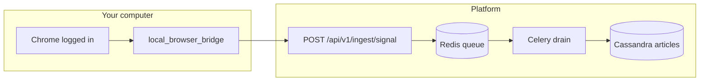

# Local browser bridge (your computer)

> **Firefox users:** prefer the [Firefox channel sync extension](firefox-channel-sync.md) — no Chrome debugging port, matches how you already browse.

## Idea

You already have the hard part solved: **you are logged in** to Discord and Telegram in your normal browser. The platform does not need to break login walls on the server.

A small script on **your PC** periodically:

1. Connects to your open browser (Chrome remote debugging).
2. Reads visible text from the channel tabs you configured.
3. If content changed, `POST`s it to **`/api/v1/ingest/signal`**.
4. Workers drain the Redis queue → same publish pipeline, scoring, and **7 articles/day** cap as every other source.

No Puppeteer on the server. No bot invite on official Discord.



## Quick start

### 1. Enable push ingest on the API

Set `INGEST_API_KEY` on the backend (same value you will use locally).

### 2. Start Chrome with debugging

```bash
google-chrome --remote-debugging-port=9222
# Or: chromium, microsoft-edge --remote-debugging-port=9222
```

Log in to Discord and Telegram. Open the **exact channel tabs** you want mirrored (keep them open or let the bridge open the URL).

### 3. Configure the bridge

```bash
cd tools/local_browser_bridge
cp targets.example.json targets.json
# Edit api_base, ingest_key, and each target url (guild/channel, telegram @handle)
pip install -r requirements.txt
playwright install chromium
```

`targets.json` is local only — add it to `.gitignore` if you store secrets there, or use `INGEST_API_KEY` in the environment and leave `ingest_key` empty.

### 4. Run

```bash
# One snapshot of all targets
python bridge.py snapshot

# Poll every poll_seconds (default 120)
python bridge.py watch
```

Unchanged content is skipped (hash stored in `~/.cache/algorand-bridge/`). Use `--force` to push anyway.

### Manual paste (no automation)

```bash
python bridge.py push \
  --service-id algorand-foundation-discord \
  --title "Weekly update" \
  --text-file announcement.txt
```

## What gets stored?

Not raw screenshots by default — **text snapshots** of what is visible in the channel (enough for the newspaper composer and change detection). Screenshots would need OCR or a vision step; we can add that later if you want image archives.

Payload fields match [push-ingest.md](push-ingest.md); `source_kind` is `local_browser` for trust/scoring.

## Security

| Topic | Guidance |
|-------|----------|
| API key | Treat like a password; env var preferred over committing `targets.json` |
| Network | Use HTTPS to production API, not plain HTTP over the internet |
| Your session | Stays on your machine; only extracted text is sent |
| Official ToS | You are using your own account in your own browser — not server-side evasion |

## When to use this vs server crawl

| Situation | Use |
|-----------|-----|
| Official Discord / private Telegram | **Local bridge** or manual push |
| Public blog / `t.me/s/` preview | Server HTTP or Playwright |
| Foundation RSS / mail | Server pollers |

## Code

- `tools/local_browser_bridge/bridge.py`
- `tools/local_browser_bridge/targets.example.json`
- API: `backend/app/modules/ingest/`
- Queue drain: `workers/app/modules/newspaper/tasks/ingest_tasks.py`

## Troubleshooting

| Problem | Fix |
|---------|-----|
| Cannot connect to CDP | Chrome must be started with `--remote-debugging-port=9222` |
| Text too short | Tab not on the channel, or SPA still loading — increase `BRIDGE_WAIT_MS=5000` |
| 401 from API | Wrong `INGEST_API_KEY` |
| Nothing publishes | Queue drains every ~30s; article may be queued below daily cap |
