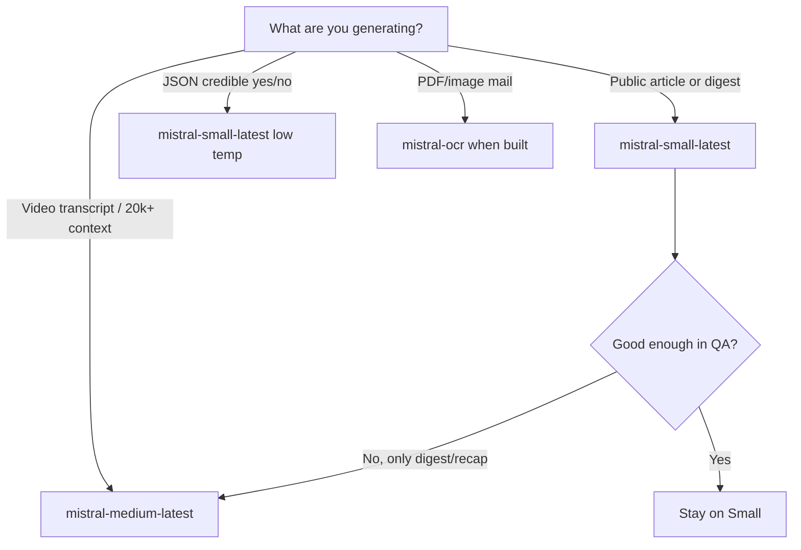

# Mistral model selection for Algorand Platform news

This estimates which Mistral models fit our **actual workloads** (not generic “best LLM” advice). Defaults in code today: `MISTRAL_MODEL=mistral-small-latest`.

Official references: [Mistral models overview](https://docs.mistral.ai/models/overview), [Pricing](https://mistral.ai/pricing/).

## What we use Mistral for

| Task | Module | Input size | Output | Quality bar | Volume (steady state) |
|------|--------|------------|--------|-------------|------------------------|
| **A — Feed articles** | `mistral_compose.compose_scrape_article_mistral` | ~6k chars source + diff | JSON: title, summary, markdown body (~1–2k tokens out) | High (public feed) | ≤7/day standard + ≤2 breaking (if LLM compose enabled) |
| **B — Weekly digest** | `compose_weekly_digest_article_mistral` | Price brief ~4k + feed titles | ~1.5k char body | High, synthesis | 1/week |
| **C — Breaking credibility** | `breaking_credibility._assess_with_mistral` | ~6k alert text + links | Tiny JSON `{credible, reason}` | **Critical** (false positive = harm) | ≤2/day |
| **D — Diff poll (optional)** | `check_and_publish_mistral_on_diff` | Same as A per changed source | Same as A | High | Bounded by registry size × change rate (expensive if all sources) |
| **E — Future** | Video recap transcript, link “case file” | Long (10k–50k+) | Long article | Highest | Rare |

Templates remain the default (`MISTRAL_ENABLED=0`, `MISTRAL_FALLBACK_TEMPLATE=1`); Mistral is an enhancement layer.

## Recommendation summary

| Tier | Model (API id) | Use for | Why |
|------|----------------|---------|-----|
| **Default production** | `mistral-small-latest` (Small 4) | A, B, most D | Best **cost/latency** for JSON + editorial prose; strong instruction-following; ~$0.10 / $0.30 per M tokens in/out (Mistral pricing page) |
| **Breaking gate only** | `mistral-small-latest` or `magistral-small-2509` | C | Small JSON verdict; prefer **low temperature**; Magistral line if you want extra reasoning on scam evidence |
| **Premium (optional)** | `mistral-medium-latest` (Medium 3.5) | E, or 1× weekly digest | Long context (256k), better multi-step reasoning; ~$1.50 / $7.50 per M tokens — use sparingly |
| **Not recommended default** | `mistral-large-latest`, Devstral | — | Overkill for 1k-token articles; cost adds up on diff poll |
| **Specialized later** | `mistral-ocr-2503` | Mail PDF / screenshot ingestion | Only if we ingest images/PDFs from mail |
| **Cheap experiments** | `ministral-3b-latest` | Internal classification, tagging | Not for published prose |

**Bottom line:** keep **`mistral-small-latest`** as the single default. Add **`mistral-medium-latest`** only for recap/transcript and optional “premium weekly” if Small quality is insufficient.

## Cost rough estimate (Mistral enabled)

Assume per article compose: **8k input + 1.2k output tokens**. Small 4 pricing ≈ $0.10/M in, $0.30/M out.

| Workload | Calls/month | Est. cost/month (Small 4) |
|----------|-------------|---------------------------|
| 7 articles/day | ~210 | ~$0.25 in + ~$0.08 out ≈ **$0.35** |
| +2 breaking checks/day | ~60 | ≈ **$0.05** |
| Weekly digest | 4 | ≈ **$0.01** |
| Diff poll (50 sources, 20% change/day) | ~300 | ≈ **$0.50** |

Total **well under $5/month** for Small at our caps. Medium 3.5 at the same volume is roughly **10–15×** output cost — still cheap for &lt;300 calls/month, but diff-poll at scale is where Medium hurts.

## Per-task settings (recommended)

```bash
# Default — articles + digest
MISTRAL_MODEL=mistral-small-latest
MISTRAL_MAX_TOKENS=1024          # enough for body; bump to 1536 for digest
MISTRAL_MAX_SOURCE_CHARS=6000    # matches scrape clip
MISTRAL_TIMEOUT_SECONDS=60

# Optional split (implemented as env overrides)
MISTRAL_MODEL_BREAKING=mistral-small-latest
MISTRAL_MODEL_DIGEST=mistral-small-latest
MISTRAL_MODEL_PREMIUM=mistral-medium-latest   # future recap / long context

# Breaking gate — only enable when key is set
BREAKING_MISTRAL_CREDIBILITY=1
# Use temperature 0.1 in code (already) for credibility JSON
```

## Quality vs risk

| Task | Wrong model risk |
|------|------------------|
| **C Breaking credibility** | False “credible” on rumor → **reputational harm**. Prefer Small + strict JSON schema; consider human review queue before publish. Medium only if Small misses nuanced scams. |
| **A Articles** | Hallucinated facts → mitigated by “facts from source only” prompt + template fallback. |
| **D Diff poll** | Cost blowout if every registry row changes often — **disable mistral_only poll** in prod or rate-limit to official sources only. |

## Decision flow



## Evaluation checklist (before locking model)

1. Run 20 real Discord/Reddit/mail snippets through **compose** (Small vs Medium blind review).
2. Run 10 scam + 10 benign posts through **breaking credibility**; measure false positives/negatives.
3. Measure p95 latency (`MISTRAL_TIMEOUT_SECONDS`) under Celery concurrency.
4. Log `composer=mistral` vs template fallback rate; target &lt;5% failures.

## Code map

- Config: `workers/app/core/config.py`
- Client: `workers/app/modules/ai/mistral_client.py`
- Prompts: `workers/app/modules/ai/mistral_compose.py`, `breaking_credibility.py`
- Connector doc: [ai-mistral-connector.md](ai-mistral-connector.md)
